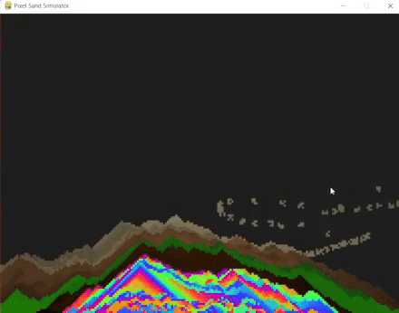

# **Pixel Sand Simulator**

## Demo



## **Overview**

**Pixel Sand Simulator** is a physics-based sandbox game that simulates the natural behavior of falling sand particles. It provides various gradient themes, and gives users control over the simulation's behavior.

## **Features**

- **Realistic Sand Simulation**: Simulates natural falling and stacking behavior of sand particles.
- **Gradient Themes**: Choose from multiple gradients like `Rainbow`, `Mountain`, `Desert`, `Nature` and `Moon`.
- **Interactive UI**: Simple and intuitive menu for selecting gradients, adjusting settings, and starting the simulation.
- **Responsive Controls**: Adjust the amount of sand and other settings in real-time.


## **Requirements**

- **Python** 3.8+
- **Pygame** library

## **Installation**

1. **Clone the repository:**

   ```bash
   git clone https://github.com/yourusername/pixel-sand-simulator.git
2. **Acess the directory:**
   ```bash
   cd pixel-sand-simulator
3. **Install pygame:**
   ```bash
   pip install pygame

## **How to use**

1. **Run the simulator**

    ```bash
    python Sim.py

2. **Main Menu**
- **Start Simulation**: Begins the sand simulation.
- **Gradient Menu**: Select the gradient theme for the simulation.
- **Exit**: Closes the simulator.

3. **Simulation Controls**
- **Mouse Click**: Spray sand particles at the cursor position.
- **ESC**: Open/Close the main menu.

4. **Gradient themes**
- **Rainbow**: Smooth transition through all rainbow colors.
- **Mountain**: Shades of grey, green, white, and brown, representing a mountain range.
- **Desert**: Merge of beach and desert colors with shades of blue, brown, and yellow.
- **Nature** : Shades of green withforest like theme.
- **Moon**: Shades of grey and white, with moon-like crater spots.

## **Troubelshooting**
- **Slow Performance**: Ensure your system meets the requirements. Consider reducing the number of particles.
- **Invalid Color Argument**: Ensure RGB values are between 0 and 255.

# **Lisence**
This project is licensed under the MIT License. See the [LICENSE](LICENSE) file for more details.

